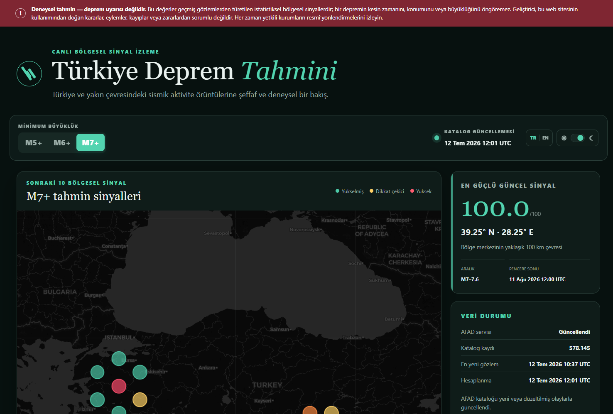

# Türkiye Earthquake Forecast

An experimental, open-source regional seismic signal dashboard for Türkiye and nearby areas. The application combines a bundled multi-source Sismik Harita catalog with daily append-only updates, calculates separate M5+ through M7+ regional rankings, and displays forward-looking regional signals on an interactive Leaflet map.

**Live Demo:** [turkiye-earthquake-forecast.vercel.app](https://turkiye-earthquake-forecast.vercel.app/)

> **Important:** This project does not predict the exact time, location, or magnitude of earthquakes. Scores are relative regional activity rankings, not occurrence probabilities. Do not use the site as an emergency warning system or as the sole basis for safety decisions. Follow official authorities.



## Development

```bash
git clone https://github.com/bariskisir/TurkiyeEarthquakeForecast.git
cd TurkiyeEarthquakeForecast
npm install
npm run lint
npm run typecheck
npm test
npm run dev
```

Open [http://localhost:3000](http://localhost:3000).

## Architecture

The request path is split into explicit, testable boundaries:

- `catalog-domain.ts` validates, normalises, deduplicates, and projects recent events without filesystem or network access.
- `sismik-client.ts` owns provider pagination, retry timing, and bounded 28-day refresh windows.
- `catalog-service.ts` coalesces daily UTC+3 refreshes and merges append-only updates through injected persistence adapters.
- `forecast/` builds one immutable base field per Türkiye calendar day and derives the full method/threshold/count matrix without shared mutable state.
- `forecast-cache.ts` coordinates memory, local temporary files, B2 bundles, stale fallback, locking, and pruning.
- `forecast-service.ts` assembles API responses while `app/api/forecast/route.ts` remains a thin HTTP adapter.
- Dashboard hooks own preferences, validated fetching, Türkiye-midnight refresh scheduling, and reducer-driven selection state; presentation is split into controls, workspace, map, modal, and recent-event components.

Vitest covers numerical primitives, catalogue parsing and orchestration, provider behavior, cache locking/fallback, API responses, dashboard interactions, and a deterministic golden forecast matrix. The bundled `data/*.json` files are never modified by tests.


## Tech Stack

- Next.js 16
- React 19
- TypeScript
- Bootstrap 5
- Sass/SCSS
- Leaflet
- OpenStreetMap and CARTO basemaps
- Backblaze B2 S3-compatible object storage
- Vercel serverless functions and CDN caching

## Data Storage and Updates

**Earthquake data source:** [Sismik Harita API](https://sismikharita.com/api). Catalogue requests are made server-side; visitors' browsers do not connect directly to Sismik Harita.

The immutable base catalogue is stored in the repository as JSON shards under `data/` and is bundled with every deployment. New and revised events are never written back into those source files. In production, append-only update shards are persisted in Backblaze B2 under `catalog/updates/`, while `catalog/meta.json` records the latest daily provider check. Daily forecast bundles are cached in B2 under `forecasts/daily-v3.8/`; legacy hourly bundles under `forecasts/v3.8/` are not read or pruned by the daily store. Each Vercel instance hydrates its ephemeral `/tmp` working cache from B2 and keeps an in-memory copy for repeated requests during the day.

Once per Türkiye calendar day (UTC+3, at the first request after midnight), the server requests the Sismik Harita earthquake-list API starting 48 hours before the newest stored event. The overlap captures both late arrivals and revisions to recent earthquakes. Stale ranges are split into windows of at most 28 days; incoming records are normalised, deduplicated by stable event identity, and compared with the stored event signature. Only new or changed records are written to a new append-only update shard. The application then merges the bundled shards with all B2 update shards, keeps the latest revision of each event, and sorts the result newest-first. The CDN freshness lifetime ends at the next Türkiye midnight. B2 is used when configured and available; otherwise remote cache operations are skipped and the application continues from its ephemeral `/tmp` and bundled catalogue without exposing a B2 error to visitors.

## Forecast Method

The forecast engine is a modular **ETAS (Epidemic-Type Aftershock Sequence)** spatio-temporal point-process model enhanced with catalogue-derived seismicity indicators and a long-term large-event repeat layer. It is computed entirely from the bundled historical/instrumental earthquake catalogue — no waveform data, no GNSS, and no neural-network training at request time. The source code lives under `src/lib/forecast/` in 20+ focused modules.

### Selectable Map Methods

The method selector changes the metric used to rank cells while reusing the same prepared catalogue and 0.5° field. **Combined** is the default. Every method is independently min-max normalised over the spatially separated reference pool, so its 40–99 display score is only a within-method regional rank and cannot be compared numerically with another method's score.

| Method | Calculation and interpretation |
|--------|--------------------------------|
| Combined | Blends ETAS rate, magnitude-history support, b-value anomaly, natural time, energy, clustering, and M6+/M7+ recurrence with threshold-specific weights. It is the default and the only method that combines evidence. |
| Poisson | Ranks the declustered, Gaussian-smoothed 10-year background annual rate after G-R scaling to the selected magnitude. It is time-independent and excludes triggered ETAS activity and all composite modifiers. |
| ETAS | Ranks total annual ETAS intensity, `λ_total = μ + λ_trig`. It responds to persistent background seismicity and recent triggering but excludes the separate composite indicator adjustments. |
| Triggered activity | Ranks only `λ_trig`, calculated from Utsu productivity, Omori-Utsu time decay, and the spatial triggering kernel. It highlights recent aftershock-like sequences instead of long-term background. |
| b-value anomaly | Ranks the positive normalised difference between global and lower local b-value. Lower local b ranks higher; cells without a supported local estimate are omitted. |
| Natural time | Ranks G-R-normalised small-event cycle progress since the latest local M5+ reset. This is a catalogue progress proxy, not an empirical occurrence probability. |
| Energy | Ranks the logarithm of the trailing five-year root-energy release rate. It measures released seismic energy, not stored tectonic energy or future rupture size. |
| Clustering | Ranks the coefficient of variation of local inter-event times. Higher values indicate more irregular, clustered timing and do not represent a Poisson occurrence probability. |
| Historical recurrence | Ranks the confidence-bounded BPT repeat score calculated from independent historical mainshocks. It requires at least three events and is available only for M6+ and M7+. |

The b-value anomaly, Natural time, Energy, and Clustering layers are independent of the selected target magnitude. The interface disables M5+/M6+/M7+ and hides the M threshold in signal headings while any of these methods is active.

For a fixed horizon, the Poisson occurrence transform `P = 1 − exp(−λH)` is monotonic in the background rate `λ`, so ranking by `λ` produces the same ordering without presenting an uncalibrated occurrence probability.

---

### 1. Conditional Intensity — the ETAS Core

The core of the model is the space-time conditional rate (events per day per km²) parameterised by the history `H_t` of all earthquakes before time `t`:

```
λ(t, x, y | H_t) = μ(x, y) + Σ_{i : t_i < t} k(M_i) · g(t − t_i) · f(||(x,y) − (x_i,y_i)||, M_i)
```

| Symbol | Meaning |
|--------|---------|
| `μ(x, y)` | **Background seismicity rate** — long-term, declustered, spatially smoothed independent-event rate |
| `k(M_i)` | **Utsu productivity** — expected number of directly triggered offspring from parent event `i` |
| `g(Δt)` | **Omori-Utsu temporal decay** — how triggering probability fades with elapsed time |
| `f(r, M)` | **Spatial kernel** — how triggered events are distributed around the parent in space, scaled by magnitude |

The model is evaluated on a regular **0.5° grid** spanning latitudes 34°N–43°N and longitudes 24°E–46°E, covering Türkiye and neighbouring tectonic regions.

---

### 2. Catalogue Preparation & Observation Quality

Every event passes through a quality-weighting pipeline that combines:

- **Review label** (reviewed/focal_mechanism → 1.0; automatic → 0.62; historical → 0.48)
- **Source agreement** — number of contributing agencies (±3% per source up to 3)
- **Magnitude spread** — inter-source disagreement penalises confidence linearly
- **Depth plausibility** (events outside 0–700 km are halved)
- **Primary record status** (non-primary duplicates are halved)

The resulting weight `w ∈ [0.1, 1.0]` is used throughout the pipeline as an observation-quality multiplier.

---

### 3. Magnitude of Completeness — Mc

The catalogue's detection threshold is estimated on a trailing **10-year calibration window**. Maximum curvature (MAXC) is combined with a 95% Gutenberg–Richter goodness-of-fit threshold (GFT95), and the more conservative result is used:

```
Mc = max(MAXC + 0.2, GFT95),    clamped to [2.0, 3.2]
```

The rolling window avoids mixing sentinel-dated historical observations and changing network sensitivity into the rate denominator. GFT95 prevents an abundant but incompletely detected small-magnitude mode from forcing Mc too low.

The window lengths are empirical engineering choices, not universal seismological constants. `npm run study:windows` performs a chronological 2012–2025 pseudo-prospective comparison of 3, 5, 7, 10, 15, 20, 25, 30, and 40-year windows plus an expanding baseline. On the recent 2019–2025 segment, the 10-year background produced 0.658 mean M5+ spatial information gain per event versus 0.442 for 20 years. Across all origins, 10-year background with 3-, 5-, and 10-year indicator windows scored 0.51126, 0.51115, and 0.51001 respectively; the differences are small, and the production model retains five years as a stable middle window. These retrospective results still require future prospective confirmation.

An alternative **Δa method** (Godano & Petrillo 2023) is also implemented as a secondary estimator for offline analysis.

---

### 4. Gutenberg-Richter Magnitude–Frequency Distribution

**Global b-value** — estimated via the Aki-Utsu (1965) maximum-likelihood estimator on all events with `M ≥ Mc`:

```
b_global = log₁₀(e) / (⟨M⟩ − (Mc − Δm/2)),    clamped to [0.6, 1.4]
```

where `⟨M⟩` is the mean magnitude of qualifying events and `Δm/2` is the half-bin correction.

**Spatially-varying b-value** — for every 0.5° cell, a local b-value is computed by pooling all M ≥ Mc events in the surrounding 3×3-cell neighbourhood (1.5° × 1.5°) and applying the same Aki-Utsu MLE with the estimated global Mc. Cells with fewer than 100 pooled events receive no local estimate. A local b-value lower than the global mean is interpreted as a stress-accumulation signal (Scholz 1968; Gulia & Wiemer 2019).

**G-R scaling factor** — to convert a rate at Mc to a rate at threshold `M_thr`:

```
S(M_thr) = 10^(−b · (M_thr − Mc))
```

The **a-value** (seismicity level) follows from the G-R law:

```
a = log₁₀(N_{M≥Mc}) + b · Mc
```

and the **expected maximum magnitude** is `M_max_expected = a / b`.

**Magnitude upper bound** for each cell is the greater of the observed maximum and a G-R extrapolation, capped at 8.5.

---

### 5. Declustering — Gardner-Knopoff Windows

Background seismicity `μ(x, y)` must be built from **independent** events only.  Aftershocks (and foreshocks) are identified by Gardner-Knopoff (1974) spatio-temporal windows applied to the chronologically sorted catalogue:

**Time window** (days after the mainshock):

```
Δt_window(M) = { 10^(0.5409 · M − 0.547),     M < 6.5
               { 10^(0.032 · M + 2.7389),       M ≥ 6.5
```

**Distance window** (km from the mainshock epicentre):

```
Δr_window(M) = 10^(0.1238 · M + 0.983)
```

An event `j` is marked as an aftershock of a larger predecessor `i` if it falls within *both* parent `i`'s time and distance windows.  Events that survive declustering are promoted as potential parents for even-earlier smaller events.  The algorithm runs in a single chronological sweep with a rolling active-parent list.

---

### 6. Background Intensity — μ(x, y)

After declustering, the independent-event rate is computed by **Gaussian kernel smoothing** (Helmstetter, Kagan & Jackson 2007) over all surviving background events:

```
μ(cell_center) = A_cell · (1 / (2π h²)) · Σ_j w_j · exp(−r_j² / (2h²)) / T_calibration
```

| Parameter | Value | Meaning |
|-----------|-------|---------|
| `h` | 25 km | Gaussian bandwidth |
| `A_cell` | ~1,350 km² | Cell area (cos(lat)-corrected) |
| `w_j` | 0.1–1.0 | Observation quality weight |
| `r_j` | varies | Distance from cell centre to event `j` (km) |
| `T_calibration` | ≤10 years | Complete rolling calibration span in days |

The result is the expected number of independent events **at the completeness magnitude Mc** per cell per day.

---

### 7. Triggered Intensity — λ_trig(x, y, t)

The ETAS **triggering kernel** is evaluated individually for each cell–event pair, summing the contributions of all M ≥ Mc events at the current reference time:

```
λ_trig(cell, now) = Σ_i  k(M_i)  ·  g(now − t_i)  ·  F(cell, event_i, M_i)
```

#### 7.1 Utsu Productivity

The expected number of directly triggered offspring is a power-law function of the parent's magnitude excess above Mc:

```
k(M) = K · exp(α · (M − Mc)),     K = 0.15,  α = 1.5
```

A magnitude-6 event (with Mc ≈ 2.6) receives higher productivity while remaining within the natural-exponential ETAS parameterisation.

**Dual productivity** (Zhang et al. 2020) is optionally enabled: events within the most recent `h · 10^(−b·Mc)` events of the catalogue use `α_short = 2.0`, while older events use `α_long = 1.4`. The triggered sum is limited to 730 days because the 100-day exponential taper leaves only about 0.00062% of the tapered temporal mass beyond that point.

#### 7.2 Temporal Decay — Omori-Utsu

The normalised time-decay probability density is

```
g(Δt) = (p − 1) / c · (1 + Δt / c)^(−p),     c = 0.05 days,  p = 1.1
```

with an optional **exponential taper** that limits long-memory contributions:

```
g_tapered(Δt) = g(Δt) · exp(−Δt / τ),     τ = 100 days
```

The taper prevents the singularity as `t → 0` from causing numerical instability and reflects finite source-region relaxation time.

#### 7.3 Spatial Kernel

Triggered events spread according to a 2-D power-law distribution whose characteristic radius grows with parent magnitude:

```
f(r, M) = (q − 1) / (π · d(M)²) · (1 + r² / d(M)²)^(−q)

d(M) = D₀ · exp(γ · (M − Mc)),     q = 1.5,  D₀ = 1.2 km,  γ = 0.5
```

The spatial kernel is normalised to integrate to 1 over ℝ². Per-cell weights are discretised and renormalised across the model grid, preventing a narrow kernel from losing nearly all of its mass when the parent is far from a coarse cell centre.

---

### 8. Seismicity Indicators

In addition to the ETAS intensity field, the pipeline computes a set of catalogue-derived statistical indicators per cell, motivated by the classical ML earthquake-prediction literature and the articles corpus:

Energy, inter-event CV, natural-time progress, and rate-change diagnostics use a trailing **5-year indicator window**, while Mc, b-values, and the background field use 10 years.

#### 8.1 Coefficient of Variation

```
CV = σ_Δt / μ_Δt
```

The standard deviation of inter-event times divided by their mean.  Interpretation:
- `CV < 1` → quasiperiodic behaviour (characteristic earthquakes)
- `CV = 1` → Poisson (memoryless)
- `CV > 1` → clustered (aftershock sequences dominate)

#### 8.2 Seismic Energy Release Rate

```
log₁₀(E) = 1.5 · M + 4.8          (E in Joules, Hanks & Kanamori 1979)

dE^(1/2) = (Σ √E_i) / T_years     (root-energy rate, proportional to √seismic_moment / year)
```

The square-root energy release rate is used as a bounded catalogue-activity feature. It measures released seismic energy and must not be interpreted as stored tectonic energy or future rupture potential.

#### 8.3 Natural-Time Cycle Progress Proxy

From the natural-time framework (Rundle et al. 2016, 2021, 2025): count the number `n` of small earthquakes (`M ≥ M_S`) that have occurred since the last large earthquake (`M ≥ M_T`) within each cell's neighbourhood.  Under Gutenberg-Richter scaling, the expected number of small events between two large events is:

```
N_GR = 10^(b · (M_T − M_S)),     (M_T = 5.0, M_S = 3.0)
```

The bounded cycle-progress feature is:

```
progress(n) = 1 − exp(−n / N_GR),     ∈ [0, 1)
```

Progress is near zero just after a large event resets the coherent 3×3-neighbourhood counter and approaches one with increasing natural time. Cells that have never recorded a target event receive no value. This is a GR-normalised proxy, not the empirical EPS probability produced by the full Rundle ensemble/ROC method.

#### 8.4 Rate-Change Z-Value

Habermann's β statistic tests whether recent seismicity deviates from the long-term mean:

```
z = (r_recent − r_long) / √(r_long / T_recent)

r_recent = N_recent / T_recent        (events/day in the trailing 365 days)
r_long   = N_total / T_indicator      (5-year indicator rate)
```

Positive `z` indicates accelerating seismicity; negative indicates quiescence. Under the null hypothesis of a homogeneous Poisson process, `z ~ N(0, 1)`. The value remains available as a diagnostic, but it is not used in the composite score: quarterly pseudo-prospective checks found no stable discrimination from chance for the following 90-day M5+ outcome.

#### 8.5 Magnitude Deficit

```
ΔM = M_max_expected − M_max_observed
```

where `M_max_expected = a / b` is the Gutenberg-Richter extrapolation. This is a descriptive catalogue residual, not evidence that a cell is “overdue”; it is reported diagnostically and is not used in the composite score.

---

### 9. Threshold Intensity Scaling

For a target magnitude threshold `M_thr ∈ {5, 6, 7}`, the total daily rate per cell is:

```
λ_total(cell, M_thr) = [μ(cell) + λ_trig(cell)] · 10^(−b · (M_thr − Mc))    [events / day]
```

Spatially varying b-values are used when available; otherwise the global b-value is used. The annualised value is a model-intensity feature for regional ranking. The UI and API deliberately do not convert it into an occurrence probability or calendar date because the parameters have not passed Türkiye-specific prospective calibration.

---

### 9B. Long-Term M6+/M7+ Repeat Model

The large-event layer scans independent mainshocks separately from the recent ETAS calibration. Duplicate source reports and aftershock sequences are removed before recurrence intervals are measured. Both thresholds use the full catalogue from year 0 onward: M6+ uses a 75 km neighbourhood and M7+ uses a 110 km neighbourhood. A cell needs at least three independent mainshocks before a value is calculated.

```
P₃₀ = [F_BPT(t_elapsed + 30) − F_BPT(t_elapsed)] / [1 − F_BPT(t_elapsed)]
```

The Brownian Passage Time model uses the local mean recurrence interval and time elapsed since the latest event. Because short historical sequences produce unstable coefficients of variation, the sample aperiodicity is shrunk toward 0.6. The BPT result is blended with a Poisson baseline according to event count and catalogue quality. Fewer than three events produces `null`, not a zero-risk value.

`P₃₀` is a conditional estimate under this catalogue-only renewal model. It is not an official earthquake probability, does not incorporate fault slip or GNSS locking, and must not be used as a warning.

`npm run study:recurrence` repeats chronological 30-year holdouts with the production quality, geometry, declustering, and BPT primitives. Across the checked origins, the standalone repeat field reached mean cell-level AUC 0.697 for M6+ and 0.596 for M7+. This is weak-to-moderate retrospective discrimination, so the layer remains confidence-bounded and subordinate to the combined model; it is not evidence of calibrated future probabilities.

---

### 10. Composite Hazard Score

The forecast does not rank cells solely by the ETAS annual rate.  Instead, a **composite hazard score** blends the log-annual rate with the indicator suite and a threshold-dependent magnitude feasibility term.  All weights are **threshold-specific** so M5+, M6+, and M7+ each emphasise different physical processes:

```
H_cell = log₁₀(λ_annual + ε)
       + ln( feas(M_thr, M_max_obs) )                     [magnitude feasibility]
       + w_b   · max(0, b_global − b_local) / b_global    [b-value anomaly]
       + w_nt  · (progress(n) − 0.5)                       [natural-time cycle]
       + w_en  · tanh(R_E / 10⁹)                           [energy release rate]
       + w_cv  · max(0, (CV − 1) / 2)                      [clustering excess]
       + w_rec · P₃₀ · (0.5 + 0.5 · confidence)             [large-event repeat history]
```

**Threshold-specific weights:**

| Weight | M5+ | M6+ | M7+ | Rationale |
|--------|-----|-----|-----|-----------|
| `w_b` (b-value anomaly) | 0.03 | 0.07 | **0.14** | M7+ is driven by long-term stress accumulation; low-b is the strongest precursor signal |
| `w_nt` (natural time) | 0.05 | 0.09 | **0.14** | Long-cycle progress is more meaningful for larger events |
| `w_en` (energy rate) | 0.04 | 0.06 | **0.10** | Released-energy activity distinguishes persistently active zones |
| `w_cv` (clustering) | **0.12** | 0.06 | 0.02 | M5+ is dominated by aftershock clustering; irrelevant for M7+ |
| `w_rec` (repeat history) | 0 | **0.50** | **1.00** | Long-term repeat evidence is limited to M6+/M7+ and confidence-bounded |

**Magnitude feasibility:** cells whose observed neighbourhood maximum magnitude is far below the target threshold are exponentially penalised:

```
feasibility = exp( −max(0, M_thr − M_max_obs)² / (2 · 0.8²) )
```

This term helps M5+, M6+, and M7+ produce different regional rankings: a cell with `M_max_obs = 5.3` gets full support for M5+, moderate support for M6+, and about 10% support for M7+.

All modifier functions are bounded (tanh, clamp) so no single extreme value can dominate. The 50 highest spatially separated candidates form a stable reference pool; their composite values are **min-max normalised** to the display range [40, 99], keeping scores consistent across the selectable 0 and 50 counts.

The **display score** is a relative regional ranking within the current catalogue, not an occurrence probability.  Each weight can be tuned independently, and new indicator layers can be added by defining a new modifier function and weight.

---

### 11. Candidate Selection

Candidates are sorted by the full composite score. Historical maximum magnitude supplies a soft feasibility penalty rather than a hard exclusion: a finite catalogue cannot prove that an unobserved magnitude is impossible in a region.

**Greedy spatial de-duplication:** candidates are accepted if they are at least ~1.8 cell widths (~100 km) from every already-selected cell. This prevents all signals from clustering in one aftershock zone. The top `N` cells (default 50, selectable as 0 or 50) are returned.

---

### 12. Signal Levels

| Score range | Signal level |
|-------------|-------------|
| ≥ 92 | very high |
| ≥ 80 | high |
| ≥ 65 | notable |
| < 65 | elevated |

---

## Articles

The `articles/` directory contains 159 research papers, reviews, and benchmark descriptions that inform the forecast design.  Key papers with directly applicable catalogue-only techniques include:

### Statistical Seismology Foundations

- Ogata, Y. (1988, 1998) — ETAS spatio-temporal point process formulation
- Gutenberg, B. & Richter, C.F. (1944) — magnitude-frequency law
- Utsu, T. (1961) — aftershock productivity and Omori-Utsu decay
- Gardner, J.K. & Knopoff, L. (1974) — space-time aftershock windows
- Aki, K. (1965) — maximum-likelihood b-value estimation
- Wiemer, S. & Wyss, M. (2000) — maximum-curvature Mc
- Helmstetter, A., Kagan, Y.Y. & Jackson, D.D. (2007) — adaptive kernel smoothing
- Wells, D.L. & Coppersmith, K.J. (1994) — rupture-length scaling
- Hanks, T.C. & Kanamori, H. (1979) — moment-magnitude relationship
- Zhuang, J., Ogata, Y. & Vere-Jones, D. (2002) — stochastic declustering

### ETAS Benchmarks & Extensions

- Stockman et al. (2026) — **EarthquakeNPP** (`earthquakenpp_benchmark_forecasting_2024.txt`): chronological earthquake forecasting benchmark; five tested neural point processes fail to outperform the ETAS baseline
- Stockman et al. (2026) — EPBench (`epbench_short_term_eq_prediction_2025.txt`): global short-term prediction benchmark with ETAS baseline; Matching Rate, False Alarm Rate, ST-MSE metrics
- Zhang et al. (2020) — **dual productivity** (`forecasting_strong_aftershocks_italy_2020.txt`): short-term vs long-term α crossover in productivity law; lag-conditional CDF memory measure
- Nandan et al. (2019) — **SVETAS** (`forecasting_rates_future_aftershocks_2016.txt`): spatially variable ETAS with Voronoi partitioning; full-aftershock-cascade simulation; EM-based independence probability
- Nandan et al. (2019) — **full-distribution forecast** (`eq_probability_forecasts_geoelectric_2019.txt`): replacing Poisson assumption with empirical distribution of earthquake numbers per cell
- Kagan, Y.Y. (2016) — Negative-Binomial Distribution for earthquake number forecasts (`forecasting_full_distribution_eq_numbers_2019.txt`)
- Mizrahi, Nandan & Wiemer (2021) — **data incompleteness** (`progress_short_term_eq_forecast_kay_2021.txt`): STAI correction for time-varying catalogue completeness in ETAS; information gain evaluation
- Muralidharan & Das (2025) — **time-scaled ETAS** (`time_scaled_ETAS_earthquake_forecasting.txt`): calendar-time rescaled ETAS variants for improved fit
- Zhong et al. (2025) — Bayesian ETAS with INLA approximation; CRPS and N-test scoring (`pseudo_prospective_eq_forecast_china_2025.txt`)
- CL-ETAS (`CL_ETAS_combining_convolutional_lstm_earthquake_forecasting.txt`): ConvLSTM + ETAS hybrid; full CSEP evaluation suite

### Seismicity Indicators & Feature Engineering

- Wang et al. (2026) — 16 seismicity indicators with Random Forest classifier (`ml_framework_strong_eq_prediction_2026.txt`): explicit formulas for b-value, a-value, energy release, root-energy, epicentre density, Mmax deficit, CV
- Kavianpour et al. (2021) — CNN-BiLSTM with attention for magnitude/count prediction from gridded catalog (`probabilistic_rupture_predictability_2021.txt`)
- Asencio-Cortés et al. (2016) — 8 seismic parameters for ELM magnitude prediction (`planet_sun_conjunctions_eq_prediction_2023.txt`): dE^(1/2), η-value, recurrence time formulas
- Matthews, Ellsworth & Reasenberg (2002) — [Brownian Passage Time model for recurrent earthquakes](https://doi.org/10.1785/0120010267)
- Working Group on California Earthquake Probabilities (2003) — conditional 30-year renewal probabilities and BPT parameter treatment
- Baveja & Singh — seismic energy rate `dE^(1/2)`, b-value least-squares and MLE methods, GR deviation σ

### Nowcasting & Natural Time

- Rundle, J.B. et al. (2016, 2021, 2025) — **nowcasting** (`physics_based_seismic_hazard_2025.txt`): DIY ensemble method converting natural-time counts into empirical conditional ROC and PPV probabilities
- Rundle, J.B. et al. — `b_value_background_seismicity_alborz_2026.txt`: nowcast transform enforcing GR uniformity across ensembles

### Seismic Energy & Physics Informed

- Kriuk, N. (2026) — **POSEIDON** (`POSEIDON_physics_optimized_seismic_energy.txt`): physics-optimised energy formula validation; GR and Omori-Utsu constraints as learnable parameters; Bath's Law loss
- `data_driven_global_annual_seismic_energy_2026.txt`: EEMD decomposition of annual seismic energy time series; Gardner-Knopoff declustered energy release

### Forecast Evaluation

- Brehmer, J. et al. (2026) — rigorous statistical evaluation (`wavecastnet_wavefield_early_warning_2024.txt`): Poisson scoring function, Diebold-Mariano test, CORP score decomposition, Murphy diagrams
- Zechar, J.D. & Jordan, T.H. (2008) — CSEP testing framework; binomial confidence bounds for Molchan diagrams
- Schorlemmer, D. et al. (2007, 2010, 2018) — CSEP N-test, M-test, S-test, L-test
- `ranking_earthquake_forecasts_scoring_2021.txt` — forecast ranking and scoring methodology
- `statistical_evaluation_earthquake_forecasts_2023.txt` — CL-ETAS passing all CSEP tests across 1/15/30-day windows
- `earthquake_prediction_benchmark_2025.txt` — matching rate, false alarm rate, spatio-temporal MSE

### Additional References

- `NESTORE` (`advancing_eq_forecast_ml_satellite_2020.txt`): Bayesian combination of N, S, Vm, Vn, Z, Q features for cluster-type classification
- `exceedance_probabilities_large_eq_2026.txt`: b-value-driven DL with Brier Skill Score, Molchan diagrams, logit rescaling for class imbalance
- `combining_dl_etas_forecast_2023.txt`: spatio-temporal b-value as precursor; ETAS as reference baseline
- `classification_earthquakes_main_shocks.txt`: triad classification of mainshocks by foreshock/aftershock count ratios
- `forecasting_earthquakes_ml_lights_shadows_2026.txt`: critical reappraisal of ML earthquake prediction; temporal validation essential
- `b_value_dl_earthquake_forecast_2026.txt`: Model Adequacy Distance (MAD) for multi-criteria physics-based evaluation
- `earthquakenpp_benchmark_forecasting_2024.txt`: 5 NPPs vs ETAS; information gain per event; pseudo-prospective log-likelihood
- `calendar_time_local_eq_forecast_2025.txt`: 25-year pseudo-prospective ETAS experiment; fat-tail P(n) ~ n^−(1+a)

*Note: approximately 85 of the 159 articles concern deep-learning, waveform-classification, structural-engineering, or geotechnical-liquefaction research that does not directly apply to the catalogue-only statistical model, but provides valuable context for future neural-network-based extensions.*

---

## References

- Ogata, Y. (1988). Statistical models for earthquake occurrences and residual analysis for point processes. *JASA*, 83(401), 9–27.
- Ogata, Y. (1998). Space-time point-process models for earthquake occurrences. *Ann. Inst. Stat. Math.*, 50(2), 379–402.
- Gutenberg, B. & Richter, C.F. (1944). Frequency of earthquakes in California. *Bull. Seismol. Soc. Am.*, 34(4), 185–188.
- Utsu, T. (1961). A statistical study on the occurrence of aftershocks. *Geophys. Mag.*, 30, 521–605.
- Gardner, J.K. & Knopoff, L. (1974). Is the sequence of earthquakes in Southern California, with aftershocks removed, Poissonian? *Bull. Seismol. Soc. Am.*, 64(5), 1363–1367.
- Aki, K. (1965). Maximum likelihood estimate of b in the formula log N = a − bM and its confidence limits. *Bull. Earthq. Res. Inst.*, 43, 237–239.
- Wiemer, S. & Wyss, M. (2000). Minimum magnitude of completeness in earthquake catalogs. *Bull. Seismol. Soc. Am.*, 90(4), 859–869.
- Helmstetter, A., Kagan, Y.Y. & Jackson, D.D. (2007). High-resolution time-independent grid-based forecast for M≥5 earthquakes in California. *Seismol. Res. Lett.*, 78(1), 78–86.
- Wells, D.L. & Coppersmith, K.J. (1994). New empirical relationships among magnitude, rupture length, rupture width, rupture area, and surface displacement. *Bull. Seismol. Soc. Am.*, 84(4), 974–1002.
- Hanks, T.C. & Kanamori, H. (1979). A moment magnitude scale. *J. Geophys. Res.*, 84(B5), 2348–2350.
- Zhuang, J., Ogata, Y. & Vere-Jones, D. (2002). Stochastic declustering of space-time earthquake occurrences. *JASA*, 97(458), 369–380.
- Mizrahi, L., Nandan, S. & Wiemer, S. (2022). Embracing data incompleteness for better earthquake forecasting. *J. Geophys. Res.*, 126(12), e2021JB022379.
- Rundle, J.B. et al. (2016). Nowcasting earthquakes. *Earth and Space Science*, 3(11), 480–486.
- Rundle, J.B. et al. (2021). Nowcasting earthquakes: a comparison of induced earthquakes in Oklahoma and tectonic earthquakes. *Pure Appl. Geophys.*, 178, 2503–2518.
- Nandan, S. et al. (2019). Forecasting the full distribution of earthquake numbers is fair, robust, and better. *Seismol. Res. Lett.*, 90(4), 1650–1659.
- Zhang, Y. et al. (2020). Improved earthquake forecasting model based on long-term memory in earthquake. *arXiv:2003.12539*.
- Kriuk, N. (2026). POSEIDON: physics-optimized seismic energy interpolation. *arXiv preprint*.
- Stockman, S. et al. (2026). EarthquakeNPP: benchmarking neural point processes for earthquake forecasting. *TMLR*.
- Gulia, L. & Wiemer, S. (2019). Real-time discrimination of earthquake foreshocks and aftershocks. *Nature*, 574, 193–199.
- Kagan, Y.Y. (2016). Earthquake number forecasts testing. *Geophys. J. Int.*, 207(1), 635–649.
- Brehmer, J. et al. (2026). Enhancing the statistical evaluation of earthquake forecasts. *arXiv preprint*.
- Muralidharan, R. & Das, S. (2025). Time-scaled ETAS model for Nepal earthquake forecasting. *J. Seismol.*.
- Wang, F. et al. (2026). ML framework with parameter optimization and regional clustering for strong earthquake prediction. *J. Seismol.*.
- Asencio-Cortés, G. et al. (2016). Earthquake prediction in California using regression algorithms and cloud-based big data infrastructure. *Comput. Geosci.*, 115, 198–210.

## License

Licensed under the [MIT License](LICENSE).
